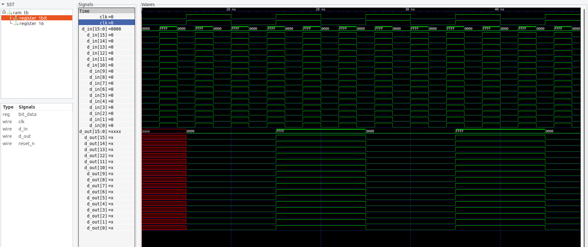

# Compile and run testbench simulation and visualise the .vcd file on gtkwave
`iverilog -o register.bin register.v register_tb.v && ./register.bin`
`gtkwave register-dump.vcd`   

# Compile and Run on FPGA 
`make all`   
`make prog`   