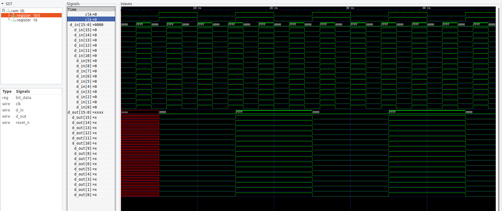

# Compile and run testbench simulation and visualise the .vcd file on gtkwave
`iverilog -o ram.bin ram.v ram_tb.v && ./ram.bin`
`gtkwave ram-dump.vcd`   

# Compile and Run on FPGA 
`make all`   
`make prog`   